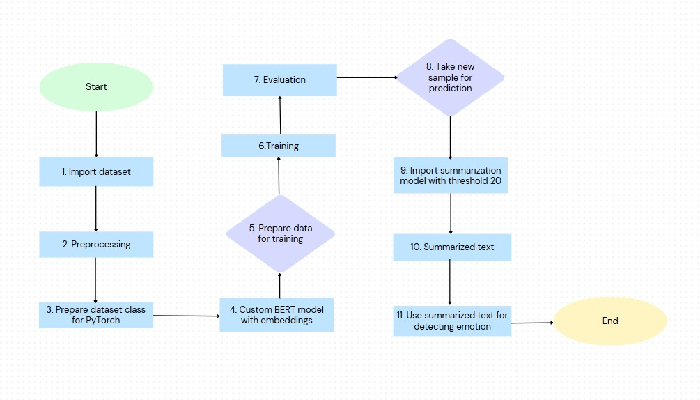
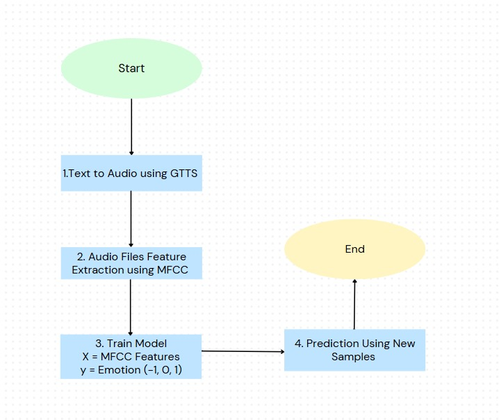

# AI-Project-

## Project Overview

This project, Emotion Recognition and Contextual Summarization for Mental Health Conversations, aims to provide AI-driven mental health assistance by recognizing emotions in conversations and summarizing contextually relevant content. We implemented two distinct approaches to achieve robust emotion detection and contextual understanding: **Audio-Driven Emotion Recognition (ADER)** and **Contextual Summarization and Emotion Prediction (CSEP)**.

## Methodology

1. **Method 1**: The **ADER approach** leverages audio analysis for emotion prediction. The process begins by converting text into audio using the Google Text-to-Speech (GTTS) system. This ensures that emotion recognition can incorporate speech characteristics for a richer understanding of emotional tones. 

Key audio features are extracted using Mel-frequency cepstral coefficients (MFCC), which capture essential sound patterns relevant to human speech. These features are then utilized as inputs for machine learning models. We trained **XGBoost** and **Random Forest** classifiers on these extracted features to predict emotional states. The system can generalize effectively, providing accurate emotion predictions on unseen audio inputs, enhancing its utility in diverse conversational scenarios.

2. **Method 2**: The **CSEP approach** focuses on emotion detection directly from text while summarizing the context for concise insights. Initially, the dataset undergoes preprocessing steps, including **tokenization of utterances** and **label encoding** for the Dialogue Act and Emotion columns. 

We employed a custom **BERT-based model** for embedding the input data, which was implemented using **PyTorch**. This model learns contextual representations of the conversations, enabling more accurate emotion predictions. Additionally, a **summarization model** with a dynamic threshold of 20 is applied to the dataset, providing a condensed version of the conversation while retaining its emotional essence. This helps streamline the analysis and enhances the interpretability of long conversations, ensuring the system delivers high-quality, actionable insights for mental health support.

<!-- ## Presentation Slides
[PPT]() -->

